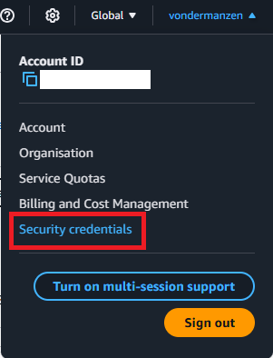
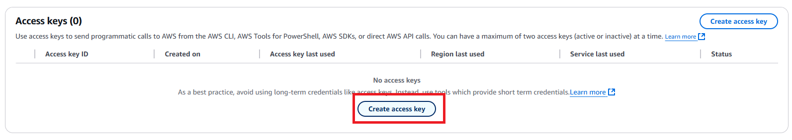
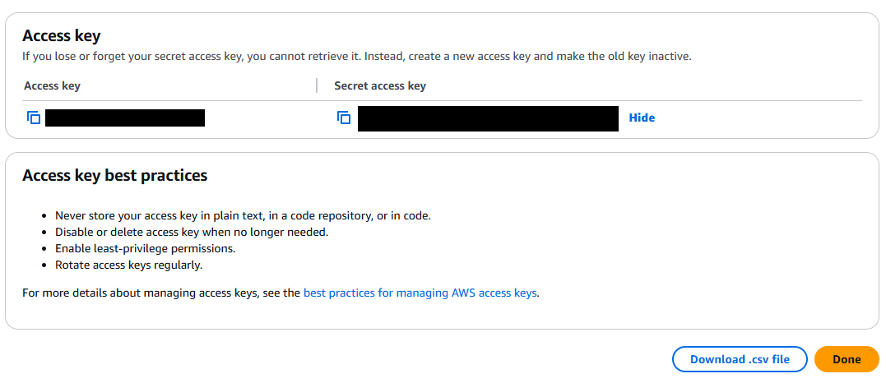
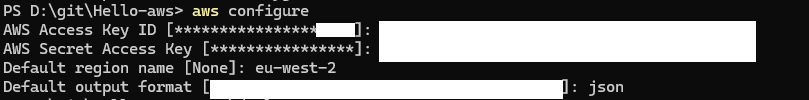
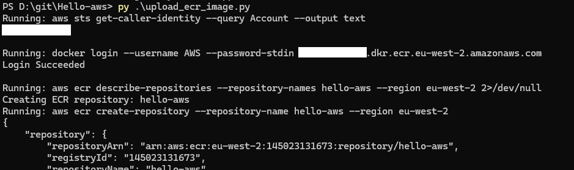
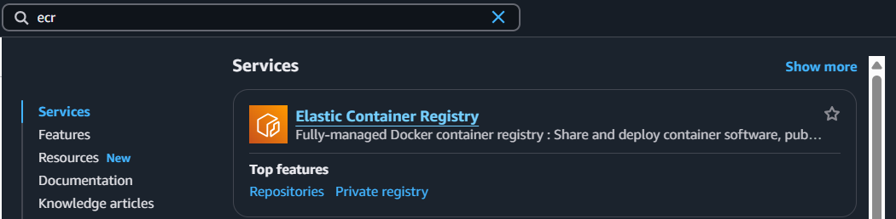
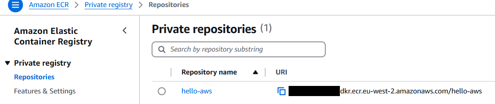
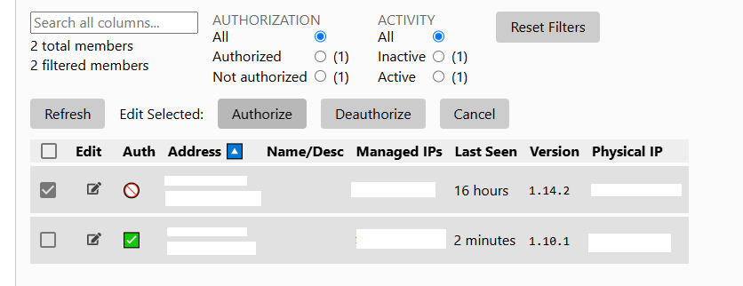

# aws-seismic-data-pipeline

Porting https://github.com/Jasplet/seismic-data-pipeline to AWS

The dashboard: 

- Displays time until the next trigger 
- Has a button for manual trigger 
- Displays VPN authorization status 

<h2>Variables to adjust</h2>

See in config.json: 
- S3 bucket name
- zero tier network id 
- repository name (ECR) 
- AWS service name

<h2>Setup the AWS CLI</h2>

Step 1. Install the AWS CLI on your local machine

https://docs.aws.amazon.com/cli/latest/userguide/getting-started-install.html

***

Step 2. In the AWS Console, go to security credentials 

***

Step 3. Create an access key 

***

Step 4. Configure AWS on your local machine

Command: aws configure

***

<h2>Upload the app to Elastic Container Registry</h2>

Step 1. Install Python on your local machine 

https://www.python.org/downloads/

***

Step 2. Install Docker on your local machine 

https://www.docker.com/get-started/

***

Step 3. Run script upload_ecr_image.py 

***

Step 4. In the AWS Console search bar, type "ecr" 

***

Step 5. Check that the repository appears 

***

<h2>Creating the service</h2>

Run create_service.py

<h2>Connect to VPN</h2>

The service will automatically attempt to join the VPN. 

Login to zerotier.com and authorize it. 

