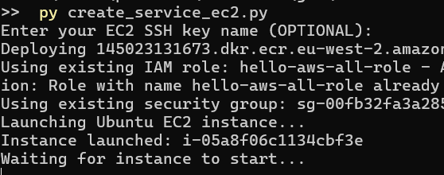

# aws-seismic-data-pipeline

Porting https://github.com/Jasplet/seismic-data-pipeline to AWS

The dashboard: 

- Displays time until the next trigger 
- Has a button for manual trigger 
- Displays VPN authorization status 

<h2>Variables to adjust</h2>

See in config.json: 
- S3 bucket name
- Zero tier network id 
- Repository name (ECR) 
- AWS service name
- Instruments ip addresses

<h2>Setup the AWS CLI</h2>

Step 1. Install the AWS CLI on your local machine

https://docs.aws.amazon.com/cli/latest/userguide/getting-started-install.html

***

Step 2. In the AWS Console, go to security credentials 

***

Step 3. Create an access key 

***

Step 4. Configure AWS on your local machine

Command: aws configure

***

<h2>Upload the app to Elastic Container Registry</h2>

Step 1. Install Python on your local machine 

https://www.python.org/downloads/

***

Step 2. Install Docker on your local machine 

https://www.docker.com/get-started/

***

Step 3. Run script upload_ecr_image.py 

***

Step 4. In the AWS Console search bar, type "ecr" 

***

Step 5. Check that the repository appears 

***

<h2>Creating the service (EC2 instance)</h2>

Step 1. Create a SSH keypair 

This is not required but strongly recommended to be able to SSH into the cloud instance (either from browser or terminal) so that you can debug problems and update your software. 

https://docs.aws.amazon.com/AWSEC2/latest/UserGuide/create-key-pairs.html

***

Step 2. Run the script (create_service_ec2.py) 

Optionally, enter the SSH key when prompted

***

<h2>Connect to VPN</h2>

The service will automatically attempt to join the VPN. 

Login to zerotier.com and authorize it. 

